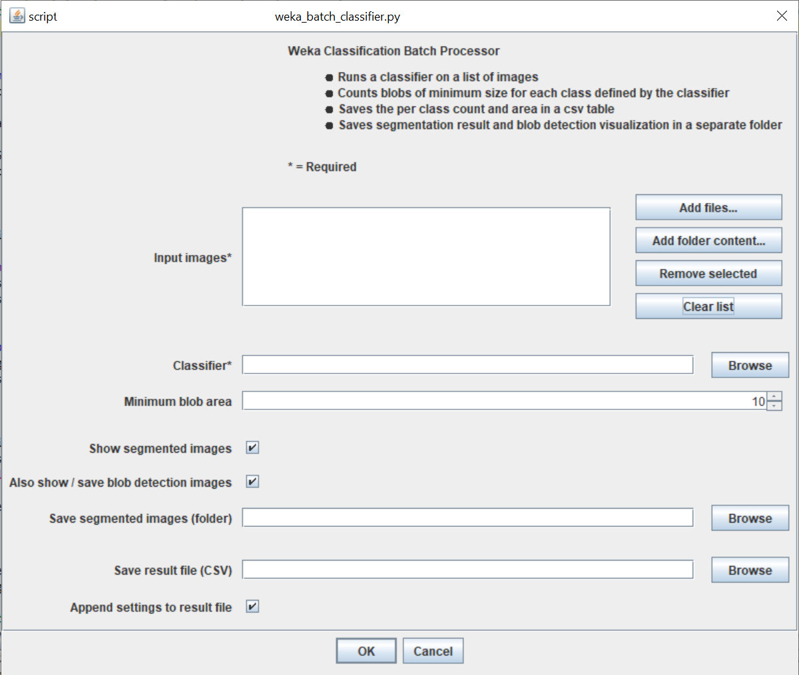

# Fiji Weka Batch Classifier
Segment and detect blobs in a batch of images using an existing weka classifier in ImageJ/Fiji.

## Installation

In Fiji select `Plugins > Install`, select the python file, save it under the suggested location.
After restarting Fiji the plugin will be in the `Plugins` menu.
